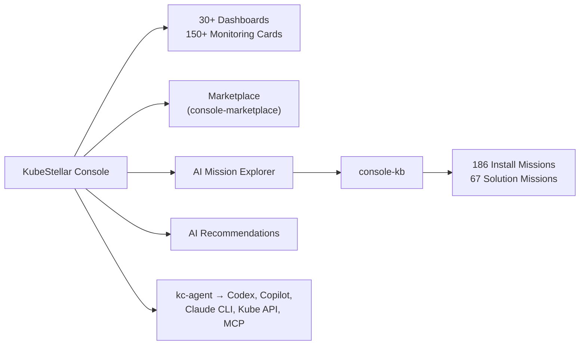

# KubeStellar Console

AI-powered multi-cluster Kubernetes dashboard with guided install missions for 250+ CNCF projects.

[**Live Demo**](https://console.kubestellar.io) | [Contributing](CONTRIBUTING.md)


## Install

```bash
curl -sSL https://raw.githubusercontent.com/kubestellar/console/main/start.sh | bash
```

Opens at [localhost:8080](http://localhost:8080). Deploy into a cluster with [`deploy.sh`](deploy.sh) (`--openshift`, `--ingress <host>`, `--github-oauth`, `--uninstall`).

**kc-agent** connects [console.kubestellar.io](https://console.kubestellar.io) to your local clusters:

```bash
brew tap kubestellar/tap && brew install --head kc-agent   # macOS
go build -o bin/kc-agent ./cmd/kc-agent && ./bin/kc-agent  # Linux (Go 1.24+)
```

## GitHub OAuth

Create a [GitHub OAuth App](https://github.com/settings/developers) with callback URL `http://localhost:8080/auth/github/callback`, then add credentials to `.env`:

```
GITHUB_CLIENT_ID=your-client-id
GITHUB_CLIENT_SECRET=your-client-secret
```

Restart with `./startup-oauth.sh` (local dev) or pass `--github-oauth` to `deploy.sh`.

To enable feedback and GitHub-powered features (nightly E2E status, community activity), go to **Settings** in the console sidebar and add a GitHub personal access token under **GitHub Token**.

## How It Works

1. **Onboarding** — Sign in with GitHub, answer role questions, get a personalized dashboard
2. **Adaptive AI** — Tracks card interactions and suggests swaps when your focus shifts (Claude, OpenAI, or Gemini)
3. **MCP Bridge** — Queries cluster state (pods, deployments, events, drift, security) via `kubestellar-ops` and `kubestellar-deploy`
4. **Missions** — Step-by-step guided installs with pre-flight checks, validation, troubleshooting, and rollback
5. **Real-time** — WebSocket-powered live event streaming from all connected clusters

## Architecture



- **[console-kb](https://github.com/kubestellar/console-kb)** — Knowledge base of guided installers for 250+ CNCF projects and solutions to common Kubernetes problems
- **[console-marketplace](https://github.com/kubestellar/console-marketplace)** — Community-contributed monitoring cards per CNCF project
- **[kc-agent](cmd/kc-agent/)** — Local agent bridging the browser to kubeconfig, coding agents (Codex, Copilot, Claude CLI), and MCP servers (`kubestellar-ops`, `kubestellar-deploy`)
- **[claude-plugins](https://github.com/kubestellar/claude-plugins)** — Claude Code marketplace plugins for Kubernetes
- **[homebrew-tap](https://github.com/kubestellar/homebrew-tap)** — Homebrew formulae for KubeStellar tools
- **[KubeStellar](https://kubestellar.io)** — Multi-cluster configuration management

## License

Apache License 2.0 — see [LICENSE](LICENSE).
