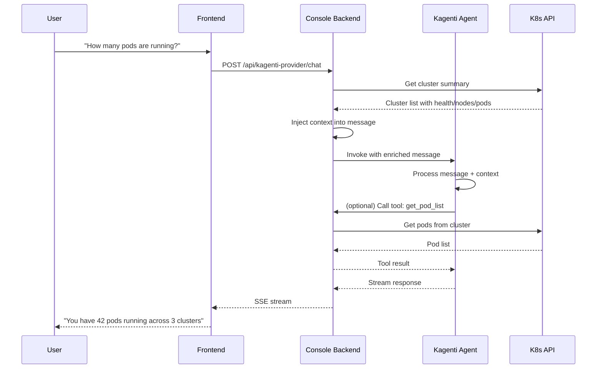

# Kagenti Tool Integration

This document describes how KubeStellar Console provides cluster context and tool-calling capabilities to Kagenti agents.

## Overview

Kagenti agents running in your Kubernetes clusters can now access cluster state through a bridge provided by the KubeStellar Console backend. When you send a message to a Kagenti agent through the console, the system automatically:

1. **Injects cluster context** — A structured summary of all clusters, their health status, node counts, and pod counts is prepended to your message
2. **Exposes console tools** — Agents can invoke tools to query cluster state in real-time
3. **Routes tool calls** — Tool invocations are proxied through the console backend to the appropriate Kubernetes API handlers

## Architecture



## Cluster Context Injection

Every chat message sent to a Kagenti agent is automatically enriched with cluster context. The console backend prepends a system context block to the user's message.

### Context Block Schema

```
--- SYSTEM CONTEXT ---
You have access to the following Kubernetes clusters:

Cluster: production-us-east
  Status: Healthy
  Nodes: 12
  Pods: 287

Cluster: staging-eu-west
  Status: Healthy
  Nodes: 4
  Pods: 58

Cluster: dev-local
  Status: Unhealthy
  Nodes: 1
  Pods: 5

You can use the following tools to query cluster state:
- get_cluster_list: Returns detailed cluster information
- get_pod_list(cluster, namespace): Returns pods in a namespace
- get_events(cluster, namespace): Returns recent warning events

--- END CONTEXT ---

[User's original message here]
```

### How It Works

1. User sends a message via the console UI
2. Frontend calls `POST /api/kagenti-provider/chat` with the message
3. Console backend:
   - Queries `DeduplicatedClusters()` to get cluster list
   - Builds context block with cluster names, health, node count, pod count
   - Prepends context block to the user's message
4. Enriched message is forwarded to the Kagenti agent
5. Agent receives both the context and the user's query in a single invocation

### Timeout Behavior

Cluster context gathering has a 10-second timeout. If cluster queries fail or time out, the original message is forwarded without context enrichment. This ensures agent availability even when cluster access is degraded.

## Available Tools

### 1. get_cluster_list

Returns a list of all deduplicated Kubernetes clusters with health status, node count, and pod count.

**Input Schema:**
```json
{
  "type": "object",
  "properties": {}
}
```

**Example Response:**
```json
{
  "tool": "get_cluster_list",
  "result": [
    {
      "name": "production-us-east",
      "context": "prod-us-east-ctx",
      "healthy": true,
      "nodeCount": 12,
      "podCount": 287
    },
    {
      "name": "staging-eu-west",
      "context": "staging-eu-ctx",
      "healthy": true,
      "nodeCount": 4,
      "podCount": 58
    }
  ]
}
```

### 2. get_pod_list

Returns a list of pods in a specific cluster and namespace.

**Input Schema:**
```json
{
  "type": "object",
  "properties": {
    "cluster": {
      "type": "string",
      "description": "Cluster name"
    },
    "namespace": {
      "type": "string",
      "description": "Kubernetes namespace (leave empty for all namespaces)"
    }
  },
  "required": ["cluster"]
}
```

**Example Invocation:**
```json
{
  "tool": "get_pod_list",
  "args": {
    "cluster": "production-us-east",
    "namespace": "default"
  }
}
```

**Example Response:**
```json
{
  "tool": "get_pod_list",
  "result": [
    {
      "name": "nginx-7d8b49c9bf-xjk2m",
      "namespace": "default",
      "cluster": "production-us-east",
      "status": "Running",
      "ready": 1,
      "total": 1,
      "restarts": 0,
      "age": "2d3h",
      "containers": [
        {
          "name": "nginx",
          "image": "nginx:1.21",
          "ready": true,
          "state": "running"
        }
      ]
    }
  ]
}
```

### 3. get_events

Returns recent warning events from a specific cluster and namespace.

**Input Schema:**
```json
{
  "type": "object",
  "properties": {
    "cluster": {
      "type": "string",
      "description": "Cluster name"
    },
    "namespace": {
      "type": "string",
      "description": "Kubernetes namespace (leave empty for all namespaces)"
    },
    "limit": {
      "type": "number",
      "description": "Maximum number of events to return (default: 50)"
    }
  },
  "required": ["cluster"]
}
```

**Example Invocation:**
```json
{
  "tool": "get_events",
  "args": {
    "cluster": "production-us-east",
    "namespace": "kube-system",
    "limit": 10
  }
}
```

**Example Response:**
```json
{
  "tool": "get_events",
  "result": [
    {
      "type": "Warning",
      "reason": "BackOff",
      "message": "Back-off restarting failed container",
      "involvedObject": {
        "kind": "Pod",
        "name": "coredns-5d78c9869d-abc12",
        "namespace": "kube-system"
      },
      "firstTimestamp": "2024-01-15T10:30:00Z",
      "lastTimestamp": "2024-01-15T10:35:00Z",
      "count": 5
    }
  ]
}
```

## API Endpoints

### GET /api/kagenti-provider/tools

Lists available console tools for Kagenti agents.

**Response:**
```json
{
  "tools": [
    {
      "name": "get_cluster_list",
      "description": "Returns a list of all Kubernetes clusters with health status, node count, and pod count",
      "inputSchema": {
        "type": "object",
        "properties": {}
      }
    },
    {
      "name": "get_pod_list",
      "description": "Returns a list of pods in a specific cluster and namespace",
      "inputSchema": {
        "type": "object",
        "properties": {
          "cluster": {
            "type": "string",
            "description": "Cluster name"
          },
          "namespace": {
            "type": "string",
            "description": "Kubernetes namespace (leave empty for all namespaces)"
          }
        },
        "required": ["cluster"]
      }
    },
    {
      "name": "get_events",
      "description": "Returns recent warning events from a specific cluster and namespace",
      "inputSchema": {
        "type": "object",
        "properties": {
          "cluster": {
            "type": "string",
            "description": "Cluster name"
          },
          "namespace": {
            "type": "string",
            "description": "Kubernetes namespace (leave empty for all namespaces)"
          },
          "limit": {
            "type": "number",
            "description": "Maximum number of events to return (default: 50)"
          }
        },
        "required": ["cluster"]
      }
    }
  ]
}
```

### POST /api/kagenti-provider/tools/call-direct

Routes tool calls to the appropriate console handlers.

**Request:**
```json
{
  "tool": "get_pod_list",
  "args": {
    "cluster": "production-us-east",
    "namespace": "default"
  }
}
```

**Response:**
```json
{
  "tool": "get_pod_list",
  "result": [...]
}
```

**Error Response:**
```json
{
  "error": "cluster parameter is required"
}
```

### POST /api/kagenti-provider/chat

Streams a Kagenti agent conversation via SSE with automatic cluster context injection.

**Request:**
```json
{
  "agent": "my-agent",
  "namespace": "default",
  "message": "How many pods are running?",
  "contextId": "optional-session-id"
}
```

**Response:** SSE stream with `data: [text]` events and `data: [DONE]` terminator.

## Adding a Custom Tool

To add a new tool to the Kagenti tool bridge:

### Step 1: Define the Tool Handler

Add a new handler method in `pkg/api/handlers/kagenti_provider_proxy.go`:

```go
// handleGetDeployments implements the get_deployments tool
func (h *KagentiProviderProxyHandler) handleGetDeployments(c *fiber.Ctx, args map[string]any) error {
	cluster, ok := args["cluster"].(string)
	if !ok || cluster == "" {
		return c.Status(fiber.StatusBadRequest).JSON(fiber.Map{"error": "cluster parameter is required"})
	}

	namespace := ""
	if ns, ok := args["namespace"].(string); ok {
		namespace = ns
	}

	ctx, cancel := context.WithTimeout(c.Context(), clusterContextTimeout)
	defer cancel()

	deployments, err := h.k8sClient.GetDeployments(ctx, cluster, namespace)
	if err != nil {
		slog.Error("get_deployments failed", "error", err, "cluster", cluster, "namespace", namespace)
		return c.Status(fiber.StatusInternalServerError).JSON(fiber.Map{"error": "failed to fetch deployments"})
	}

	return c.JSON(fiber.Map{
		"tool":   "get_deployments",
		"result": deployments,
	})
}
```

### Step 2: Register the Tool in GetTools

Update the `GetTools()` method to include your new tool:

```go
tools = append(tools, map[string]any{
	"name":        "get_deployments",
	"description": "Returns a list of deployments in a specific cluster and namespace",
	"inputSchema": map[string]any{
		"type": "object",
		"properties": map[string]any{
			"cluster": map[string]any{
				"type":        "string",
				"description": "Cluster name",
			},
			"namespace": map[string]any{
				"type":        "string",
				"description": "Kubernetes namespace (leave empty for all namespaces)",
			},
		},
		"required": []string{"cluster"},
	},
})
```

### Step 3: Route the Tool Call

Add a case to the `CallToolDirect` switch statement:

```go
switch req.Tool {
case "get_cluster_list":
	return h.handleGetClusterList(c)
case "get_pod_list":
	return h.handleGetPodList(c, req.Args)
case "get_events":
	return h.handleGetEvents(c, req.Args)
case "get_deployments":
	return h.handleGetDeployments(c, req.Args)
default:
	return c.Status(fiber.StatusNotFound).JSON(fiber.Map{"error": "unknown tool"})
}
```

### Step 4: Update Cluster Context (Optional)

If your tool should be advertised in the cluster context block, update `enrichMessageWithClusterContext()`:

```go
contextBuilder.WriteString("You can use the following tools to query cluster state:\n")
contextBuilder.WriteString("- get_cluster_list: Returns detailed cluster information\n")
contextBuilder.WriteString("- get_pod_list(cluster, namespace): Returns pods in a namespace\n")
contextBuilder.WriteString("- get_events(cluster, namespace): Returns recent warning events\n")
contextBuilder.WriteString("- get_deployments(cluster, namespace): Returns deployments\n")
```

### Complete Example

Here's a full example showing the entire flow for a hypothetical `get_services` tool:

```go
// In pkg/api/handlers/kagenti_provider_proxy.go

// handleGetServices implements the get_services tool
func (h *KagentiProviderProxyHandler) handleGetServices(c *fiber.Ctx, args map[string]any) error {
	cluster, ok := args["cluster"].(string)
	if !ok || cluster == "" {
		return c.Status(fiber.StatusBadRequest).JSON(fiber.Map{"error": "cluster parameter is required"})
	}

	namespace := ""
	if ns, ok := args["namespace"].(string); ok {
		namespace = ns
	}

	ctx, cancel := context.WithTimeout(c.Context(), clusterContextTimeout)
	defer cancel()

	// Assuming GetServices exists in k8s.MultiClusterClient
	services, err := h.k8sClient.GetServices(ctx, cluster, namespace)
	if err != nil {
		slog.Error("get_services failed", "error", err, "cluster", cluster, "namespace", namespace)
		return c.Status(fiber.StatusInternalServerError).JSON(fiber.Map{"error": "failed to fetch services"})
	}

	return c.JSON(fiber.Map{
		"tool":   "get_services",
		"result": services,
	})
}

// In GetTools(), add:
tools = append(tools, map[string]any{
	"name":        "get_services",
	"description": "Returns a list of Kubernetes services in a specific cluster and namespace",
	"inputSchema": map[string]any{
		"type": "object",
		"properties": map[string]any{
			"cluster": map[string]any{
				"type":        "string",
				"description": "Cluster name",
			},
			"namespace": map[string]any{
				"type":        "string",
				"description": "Kubernetes namespace (leave empty for all namespaces)",
			},
		},
		"required": []string{"cluster"},
	},
})

// In CallToolDirect(), add:
case "get_services":
	return h.handleGetServices(c, req.Args)
```

## Limitations

### Console Access Requirements

- **In-cluster kubeconfig**: The console must have access to an in-cluster kubeconfig or a kubeconfig with credentials for the target clusters
- **RBAC permissions**: The console's ServiceAccount must have permissions to list clusters, pods, events, and any other resources exposed via tools
- **Network reachability**: The console backend must be able to reach the Kubernetes API servers

### Agent Configuration

- **Tool callback URL**: The Kagenti agent must be configured to call tools back to the console endpoint (`/api/kagenti-provider/tools/call-direct`)
- **Agent-to-agent communication**: If using the Kagenti A2A protocol, agents must have network access to the console backend

### Controller mode vs direct-agent mode

Mission Control can reach Kagenti in two supported in-cluster layouts:

1. **Controller mode (default)**
   - The console talks to the Kagenti controller and discovers agents from `GET /api/kagenti-provider/agents`
   - Missions require **at least one registered agent** in that discovery list
   - If the controller is reachable but returns zero agents, Mission Control cannot start a mission

2. **Direct-agent mode**
   - The console skips controller discovery and targets one agent service directly
   - Use this when you want Missions to always talk to a specific agent

**Helm values**

```yaml
kagenti:
  directAgentUrl: "http://my-agent.my-namespace.svc:8080"
  directAgentName: "my-agent"
  directAgentNamespace: "my-namespace"
```

**Equivalent environment variables**

```bash
KAGENTI_AGENT_URL=http://my-agent.my-namespace.svc:8080
KAGENTI_AGENT_NAME=my-agent
KAGENTI_AGENT_NAMESPACE=my-namespace
```

- `kagenti.directAgentUrl` / `KAGENTI_AGENT_URL` enables direct-agent mode
- `kagenti.directAgentName` / `KAGENTI_AGENT_NAME` controls the displayed agent name in the console
- `kagenti.directAgentNamespace` / `KAGENTI_AGENT_NAMESPACE` controls the displayed namespace in the console
- If you stay in controller mode, make sure at least one Kagenti agent is registered before opening Mission Control

### Performance Considerations

- **Cluster context timeout**: Context gathering has a 10-second timeout per chat invocation. For clusters with slow API servers, context may be omitted
- **Tool call latency**: Tool calls are synchronous HTTP requests to Kubernetes APIs. Large result sets or slow clusters can cause delays
- **No caching**: Cluster context is fetched fresh on every chat invocation. Future versions may add caching

### Security Considerations

- **Privilege escalation**: Tools run with the console backend's ServiceAccount privileges, not the user's. Ensure proper RBAC is configured
- **Data exposure**: Cluster state is exposed to Kagenti agents. Only deploy agents you trust
- **No audit trail**: Tool invocations are logged but not stored in an audit log. Monitor console backend logs for suspicious activity

## Troubleshooting

### Agents don't receive cluster context

**Symptom:** Agent responds with "I don't have access to cluster data" even though clusters are configured.

**Diagnosis:**
1. Check console backend logs for "failed to fetch cluster list for kagenti context"
2. Verify console has a valid kubeconfig: `kubectl config view` (inside console pod)
3. Test cluster connectivity: `curl -k https://<api-server>/api/v1/namespaces`

**Solution:** Ensure the console's kubeconfig is correctly mounted and has cluster access.

### Tool calls return 503 Service Unavailable

**Symptom:** `POST /api/kagenti-provider/tools/call-direct` returns 503.

**Diagnosis:**
1. Check if `h.k8sClient` is nil (console started without a kubeconfig)
2. Verify `KUBECONFIG` environment variable or in-cluster config

**Solution:** Provide a valid kubeconfig to the console backend.

### Tool calls timeout

**Symptom:** Tool invocations hang or return errors after 10 seconds.

**Diagnosis:**
1. Check if the target cluster is reachable from the console pod
2. Review cluster health: `GET /api/kagenti-provider/tools/call-direct` with `{"tool": "get_cluster_list"}`
3. Check for slow API servers or large namespaces

**Solution:** Increase `clusterContextTimeout` in `pkg/api/handlers/kagenti_provider_proxy.go` or optimize cluster queries.

### Mission Control reports zero Kagenti agents discovered

**Symptom:** Mission Control says Kagenti is available, but no agents are discovered.

**Diagnostic path:**
1. Call `GET /api/kagenti-provider/status`
   - If `available=false`, fix connectivity first (controller URL, Service, RBAC, or direct-agent URL)
2. Call `GET /api/kagenti-provider/agents`
   - If the response is `{"agents":[]}`, the console can reach Kagenti but no agent is registered for Mission Control to use
3. Check which deployment mode you intended:
   - **Controller mode:** confirm at least one agent is registered with the Kagenti controller
   - **Direct-agent mode:** confirm `kagenti.directAgentUrl`, `kagenti.directAgentName`, and `kagenti.directAgentNamespace` (or the `KAGENTI_AGENT_*` env vars) are set on the console deployment
4. If using Helm, inspect the rendered Deployment and verify the `KAGENTI_AGENT_URL`, `KAGENTI_AGENT_NAME`, and `KAGENTI_AGENT_NAMESPACE` environment variables are present when direct-agent mode is expected

**Solution:** Register at least one Kagenti agent in controller mode, or configure direct-agent mode so the console can synthesize a single reachable agent.

### Context block is missing from agent messages

**Symptom:** Agent receives the user's message but not the `--- SYSTEM CONTEXT ---` block.

**Diagnosis:**
1. Check console backend logs for "failed to fetch cluster list for kagenti context"
2. Verify `DeduplicatedClusters()` returns non-empty results
3. Check if cluster query timed out (10s limit)

**Solution:** Fix cluster access issues or increase timeout.

## Future Enhancements

Planned improvements for the Kagenti tool integration:

- **Context caching**: Cache cluster summary for 60 seconds to reduce API load
- **Tool discovery**: Agents can query `GET /api/kagenti-provider/tools` to discover available tools dynamically
- **Streaming tools**: Support long-running tool invocations (e.g., watching pod logs)
- **User-scoped tools**: Execute tools with the user's kubeconfig instead of the console's ServiceAccount
- **Audit logging**: Store tool invocations in a structured audit log for compliance
- **MCP bridge**: Expose console tools as MCP servers for standardized tool calling

## References

- [Kagenti Agent Documentation](https://kagenti.dev)
- [KubeStellar Console API Reference](../api/)
- [Multi-Cluster Client Implementation](../../pkg/k8s/client.go)
- [Kagenti Provider Proxy Handler](../../pkg/api/handlers/kagenti_provider_proxy.go)
